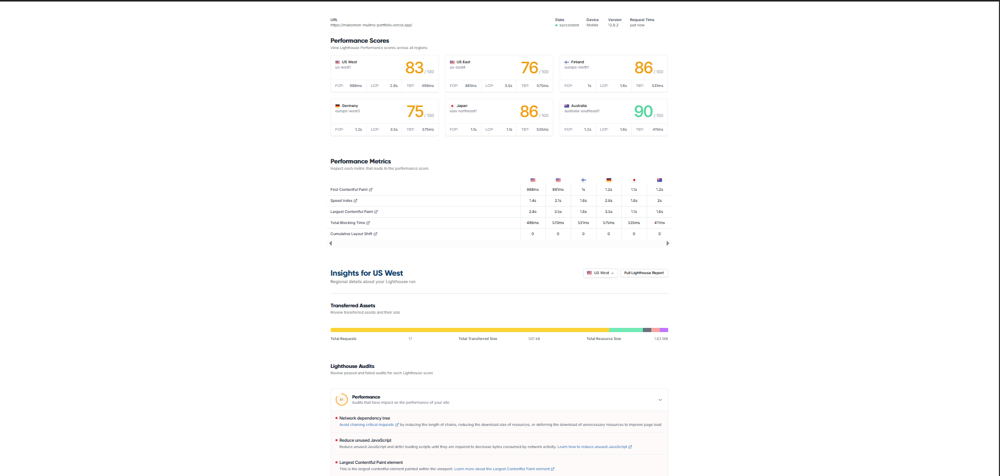
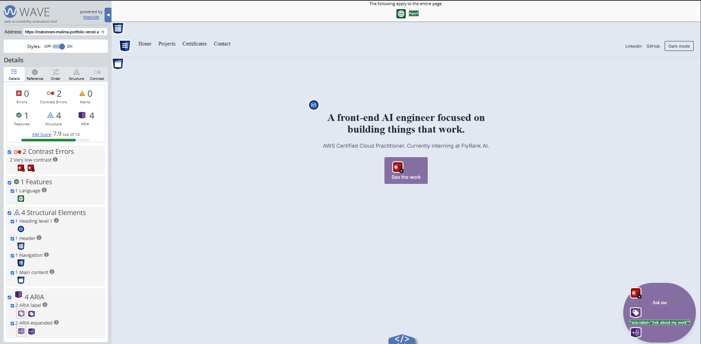
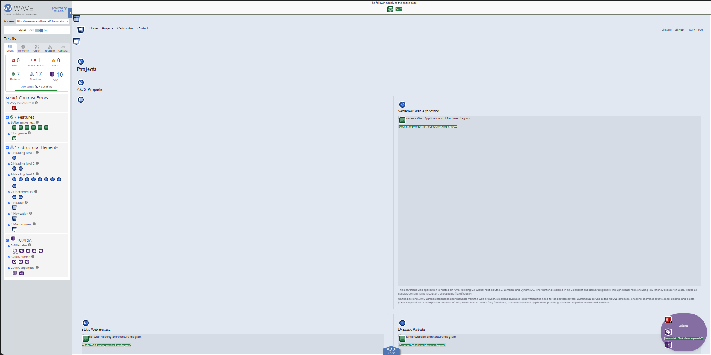
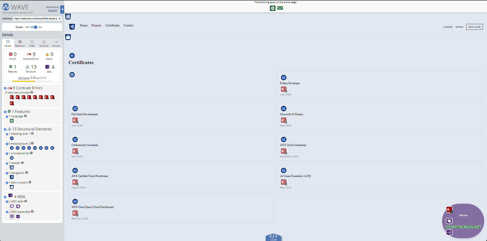
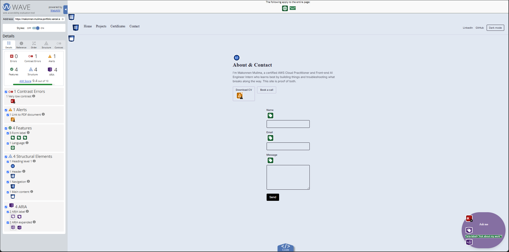
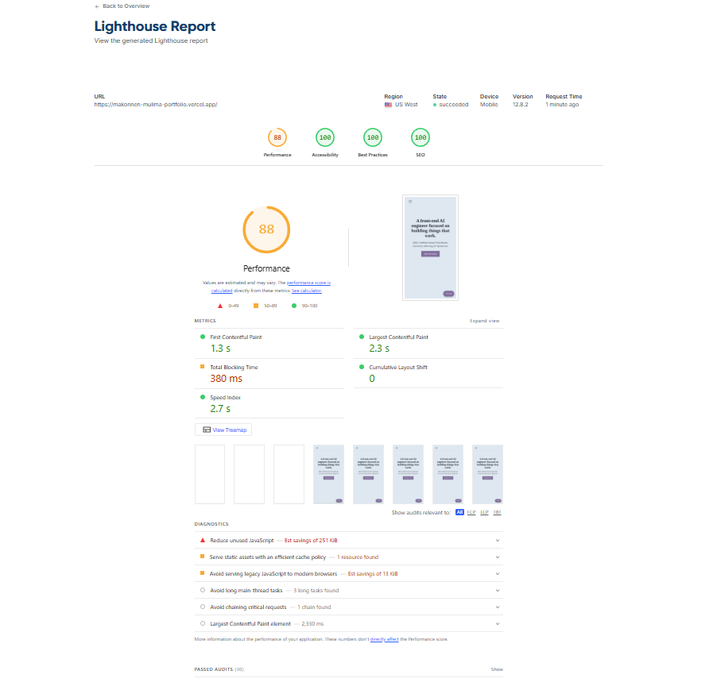
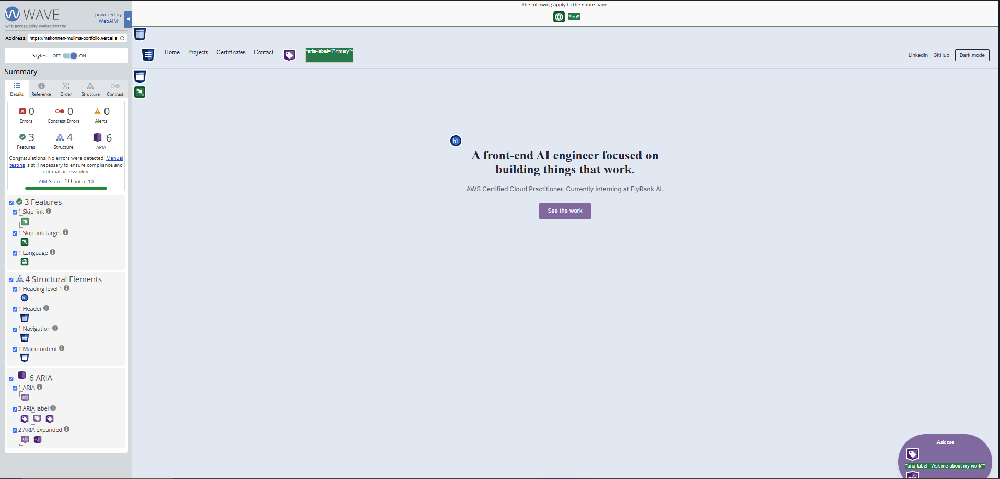
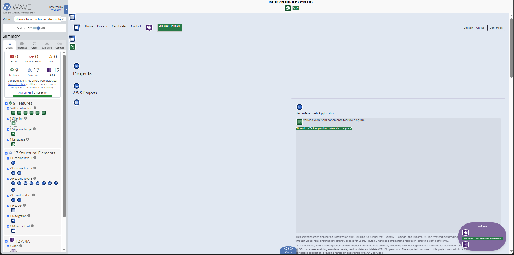
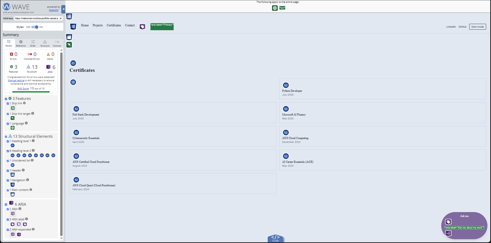
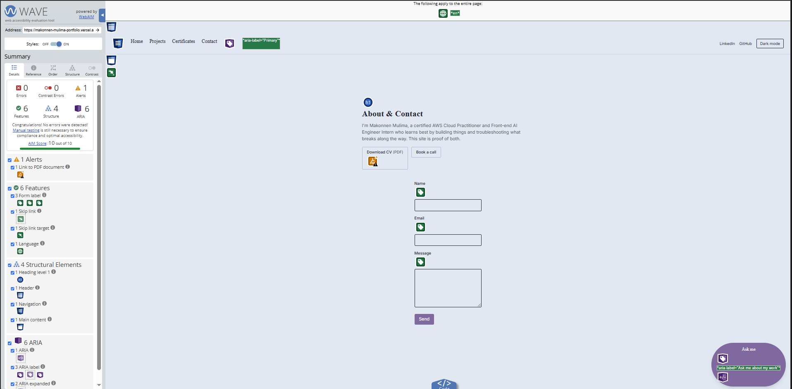

# Accessibility & Performance Audit

Audit of [makonnen-mulima-portfolio.vercel.app](https://makonnen-mulima-portfolio.vercel.app) — Lighthouse (mobile), WAVE, and a manual keyboard-only pass through the primary flow (chat included).

## Before

**Lighthouse (mobile), per region:**

| Region | Performance |
|---|---|
| US West | 83 |
| US East | 76 |
| Finland | 86 |
| Germany | 75 |
| Japan | 86 |
| Australia | 90 |

US West: LCP 2.8s, TBT 496ms, CLS 0. No Accessibility score was captured at this stage — the WAVE results below stood in as the accessibility baseline instead.

**WAVE, per page:**

| Page | Errors | Contrast errors | Alerts | AIM Score |
|---|---|---|---|---|
| Home | 0 | 2 | 0 | 7.9/10 |
| Projects | 0 | 1 | 0 | 9.7/10 |
| Certificates | 0 | 9 | 0 | 5.8/10 |
| Contact | 0 | 1 | 1 | 9.4/10 |

## Changes made

**Contrast — measured with real relative-luminance math, not eyeballed:**

- The `brand` color token itself was 0.18 short of AA for white text (`#8670A3` → 4.32:1, needs 4.5:1). Darkened 2% in lightness, same hue/saturation, to `#816A9F` (4.68:1). This single token change fixed every `bg-brand` + `text-white` usage at once — the homepage CTA, the chat toggle button, chat message bubbles, and the project category badges — rather than patching each one individually.
- `text-red-600` (error/failure text in the contact form and chat widget) failed AA in both light and dark mode (3.91:1 / 4.35:1). Unified onto `text-red-700 dark:text-red-400`, the same pairing already used correctly elsewhere in the codebase (5.24:1 / 7.59:1).
- The site's muted-secondary-text convention (`opacity-40/50/60`) genuinely failed AA in light mode at every level tested (opacity-60 → 3.86:1, opacity-50 → 2.94:1, opacity-40 → 2.28:1; all need 4.5:1 for normal text). This was systemic across 7 files — `ProjectCard`, the button-demo page, the 3D-viewer page, `LazyViewer`, `ReducedMotionFallback`, `ChatWidget`, and the certificates page. Every real-text usage was bumped to `opacity-70` (5.10:1 light / 9.90:1 dark), which is exactly what drove the certificates page from 9 contrast errors to 0. Disabled-control opacity (WCAG-exempt) and decorative status-indicator dots were left untouched.

**Landmarks & structure:**

- Added a skip-to-main-content link, visually hidden until focused.
- The mobile nav menu had no `<nav>` landmark at all — the only `<nav>` element was the desktop one, `display:none` on mobile and therefore absent from the accessibility tree on phones. Restructured so both desktop and mobile nav are properly landmarked (`aria-label="Primary"` / `aria-label="Mobile"`).
- External links (LinkedIn, GitHub) now include a visually-hidden "(opens in a new tab)" cue for screen reader users.

**AI-specific accessibility:**

- The chat message list had no `aria-live` region at all — streamed tokens, tool-call states, everything, announced to nobody. Added `role="log" aria-live="polite" aria-relevant="additions text"`.
- The chat's Stop button was already keyboard-reachable, but the text input goes `disabled` the instant streaming starts, which silently drops keyboard focus with no indication of where it went. Focus now moves to the Stop button instead the moment streaming begins.
- The chat toggle's `aria-label="Ask about my work"` didn't contain its own visible text ("Ask me") — a WCAG 2.5.3 (Label in Name) failure, independently confirmed by WAVE. Now `"Ask me about my work"`.

**Forms:**

- Contact form error messages relied only on `aria-describedby`, which doesn't proactively announce when an error first appears on blur. Added `role="alert"` so errors announce immediately.
- The "Download CV" link now indicates it's a PDF (`Download CV (PDF)`), addressing WAVE's "Link to PDF document" alert.

**A user-reported bug that turned out to share a root cause with a real contrast failure:**

- The contact form's Send button was hardcoded `bg-black`, which is why it never responded to the light/dark theme toggle. Replaced with the site's standard `bg-brand dark:bg-brand-dark` pattern — fixing both the theming bug and, since it now uses the corrected brand token, its contrast as well.

**Performance — "reduce unused JavaScript":**

- `ChatWidget` (with its full AI SDK, Streamdown markdown renderer, and `ProjectCard`) was statically imported into the root layout, so its entire dependency tree shipped on **every page**, whether or not anyone ever opened the chat. Confirmed via the actual rendered HTML of two different pages: a 464KB chunk loaded on both, unconditionally.
- Split into a lightweight `ChatWidget` (just the toggle button, no heavy dependencies — this is now the entire cost every page pays) and a new `ChatPanel` containing everything interactive, lazy-loaded via `next/dynamic({ ssr: false })` and only mounted once the widget is actually opened. Added an idle-time prefetch so the first real click still feels instant.
- Confirmed after the fix, the same way: the AI SDK chunks now appear **only** in Next's `react-loadable-manifest.json` (its dynamic-import tracking), and a direct string search confirmed **zero** references to them in either page's actual rendered HTML.

## After

**Lighthouse (mobile), production URL, US West:**

| Metric | Before | After |
|---|---|---|
| Performance | 83 | **88** |
| Accessibility | — | **100** |
| Best Practices | — | **100** |
| SEO | — | **100** |
| LCP | 2.8s | 2.3s |
| TBT | 496ms | 380ms |
| CLS | 0 | 0 |

**WAVE, per page, production URL:**

| Page | Errors | Contrast errors | Alerts | AIM Score |
|---|---|---|---|---|
| Home | 0 | 0 | 0 | **10/10** |
| Projects | 0 | 0 | 0 | **10/10** |
| Certificates | 0 | 0 | 0 | **10/10** |
| Contact | 0 | 0 | 1 | **10/10** |

The one remaining alert on the Contact page (Link to PDF document) is WAVE's standard, inherent nudge on any link resolving to a PDF — it doesn't clear automatically. The recommended remediation (indicating the file type in the link text) is already in place: `Download CV (PDF)`.

**Keyboard-only pass:** completed manually against the production URL — the primary flow (opening the chat, asking a question, reading the streamed response, stopping mid-stream) is fully completable using only the keyboard.

## What I'd flag rather than call a full win

Performance landed at **88**, not the 90+ this track aims for — though it comfortably clears the rubric's absolute minimum of 80. Lighthouse's own diagnostics still show roughly 251 KiB of unused JavaScript remaining beyond what the `ChatWidget` fix addressed (the 3D-viewer's own dependencies are already confirmed isolated to `/3d-viewer` only, so this is something else — not yet root-caused). Given time constraints, 88 was accepted rather than chased further this round; the exact source of that remaining 251 KiB is the natural next thing to dig into if this gets revisited.
